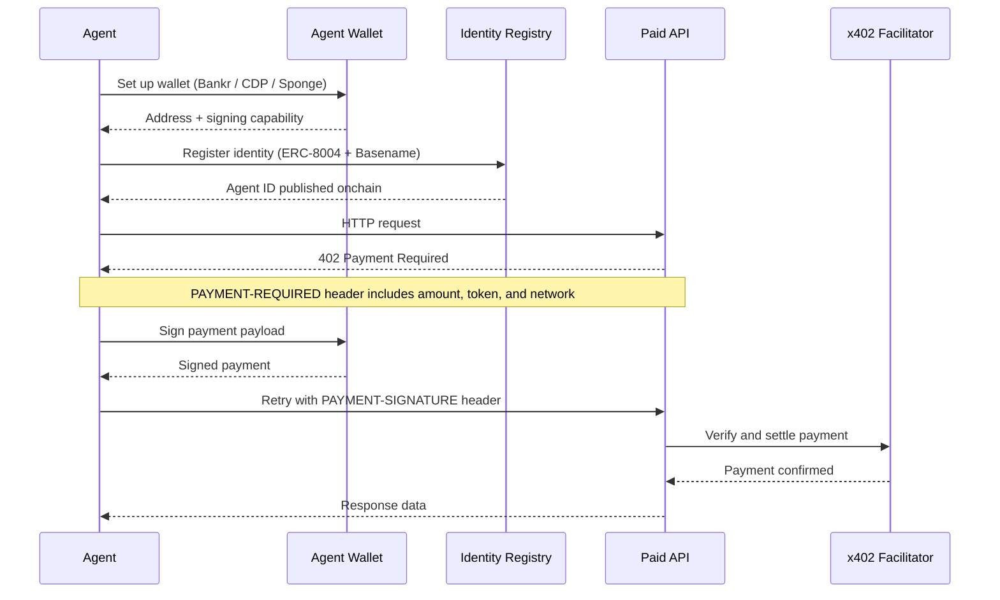

import { AgentPaymentDemo } from "/snippets/AgentPaymentDemo.jsx"

Base gives your AI agent the tools to operate as an independent economic actor: a wallet to hold and spend funds, identity standards so other agents and services can trust it, and payment protocols for services and commerce.

## Mock Demo

<AgentPaymentDemo />

### High-level flow

Here's how the agent you can build from these guides operates end-to-end — from wallet setup and identity registration to making authenticated, paid API requests using the [x402 protocol](https://www.x402.org).

## How this section is organized

The AI agents section covers the full stack for building an autonomous onchain agent:

- **[Quickstarts](/ai-agents/quickstart/payments)** — End-to-end walkthroughs to get a working agent running in minutes. Start here if you're new.
- **[Setup](/ai-agents/setup/wallet-setup)** — Give your agent a wallet and a registered onchain identity. Wallets let it hold funds and authorize transactions; registration lets other agents and services verify who they're dealing with.
- **[Payments](/ai-agents/payments/pay-for-services-with-x402)** — Use x402 to pay for API access per-request in stablecoins, with no subscriptions or API keys required. Or gate your own endpoints to charge other agents.
- **[Trading](/ai-agents/trading/data-fetching)** — Fetch live market data and execute token swaps on Base.
- **[Skills](/ai-agents/skills)** — Installable knowledge packs that give your AI coding assistant deep context on Base APIs, tooling, and migration paths.

## Choose your path

<CardGroup cols={2}>
  <Card title="Accept & make payments" icon="bolt" href="/ai-agents/quickstart/payments">
    Build an agent that pays for API access with stablecoins and charges other agents for your services. Get running in under 10 minutes.
  </Card>

  <Card title="Build a trading agent" icon="chart-line" href="/ai-agents/quickstart/trading">
    Build an agent that fetches live market data and executes token swaps automatically on Base.
  </Card>
</CardGroup>